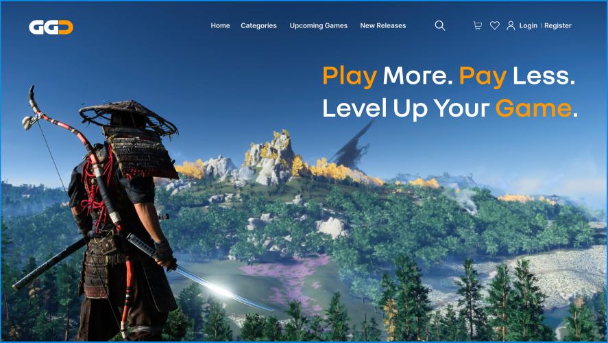

> 
> 
> Bienvenido al repositorio del proyecto final de Desarrollo de Aplicaciones Web.
> 
> Este proyecto simula una tienda digital de videojuegos inspirada en plataformas como GG.deals o InstantGaming. Permite a > usuarios explorar un catálogo filtrable, realizar compras de claves digitales, gestionar reservas, y ofrece un panel > administrativo completo.
>
> 
> ## Secciones
> 
> - [Guía de instalación](./docs/guia-instalacion.md)
> - [Cómo usar el proyecto](./docs/uso.md)
> - [Contribuir al proyecto](./docs/contribucion.md)
> 
> ## Tecnologías utilizadas
> 
> - **Frontend**: React, TypeScript, Tailwind CSS, React Router
> - **Backend**: Spring Boot, Spring Security, JWT, Thymeleaf, Bootstrap
> - **Base de Datos**: MySQL
> - **Contenerización**: Docker + Docker Compose

