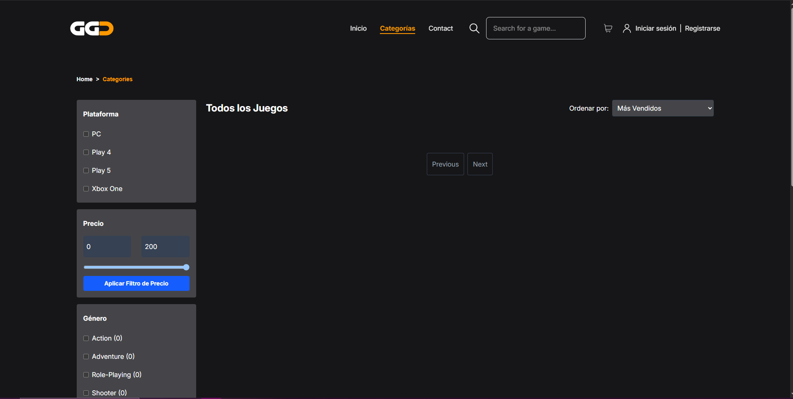
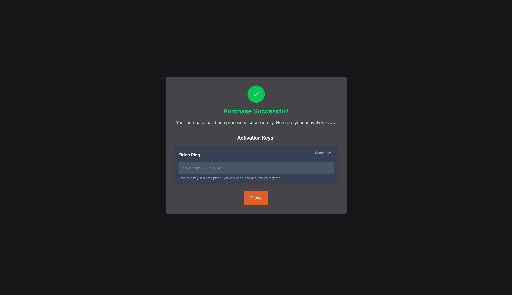
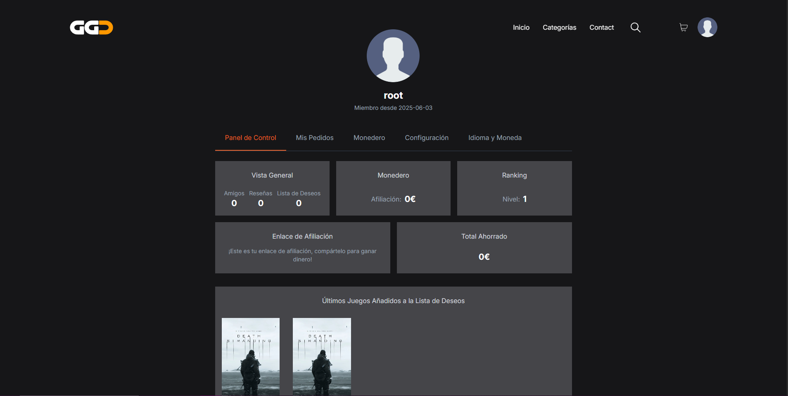
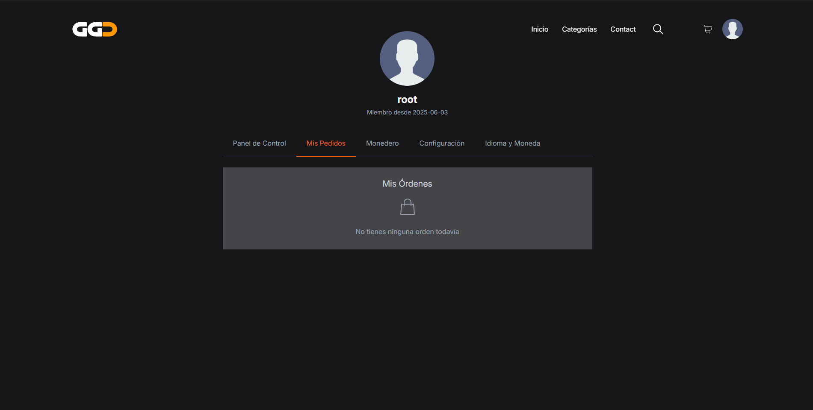
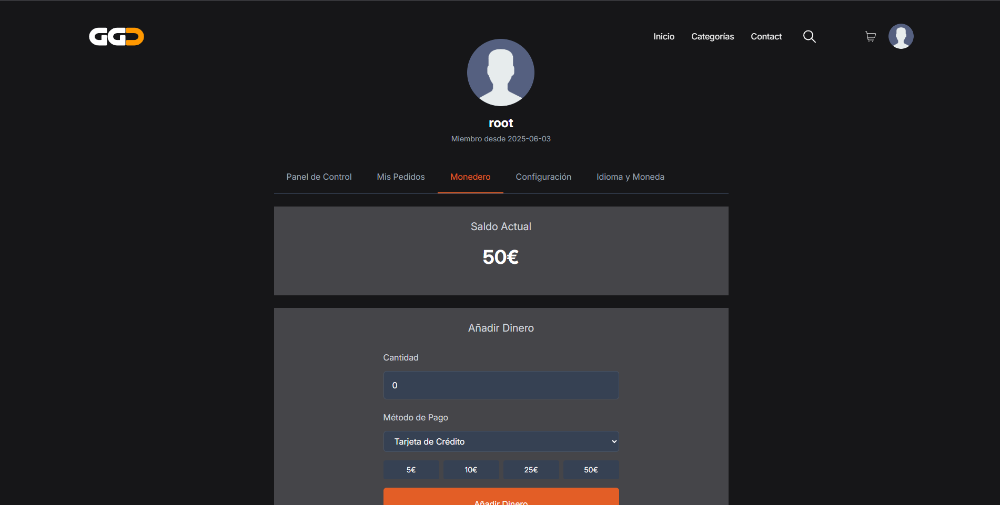
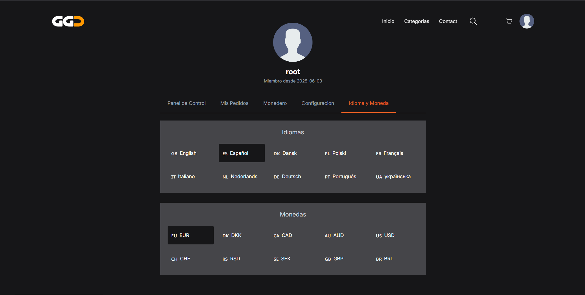
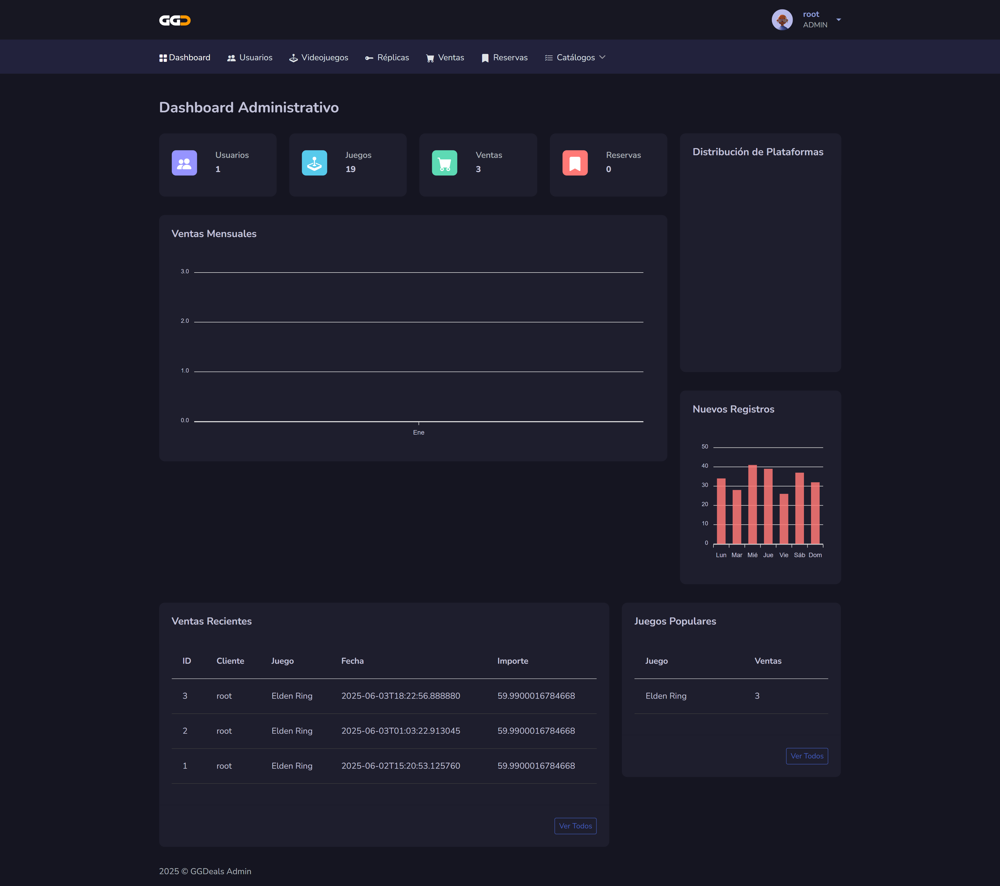
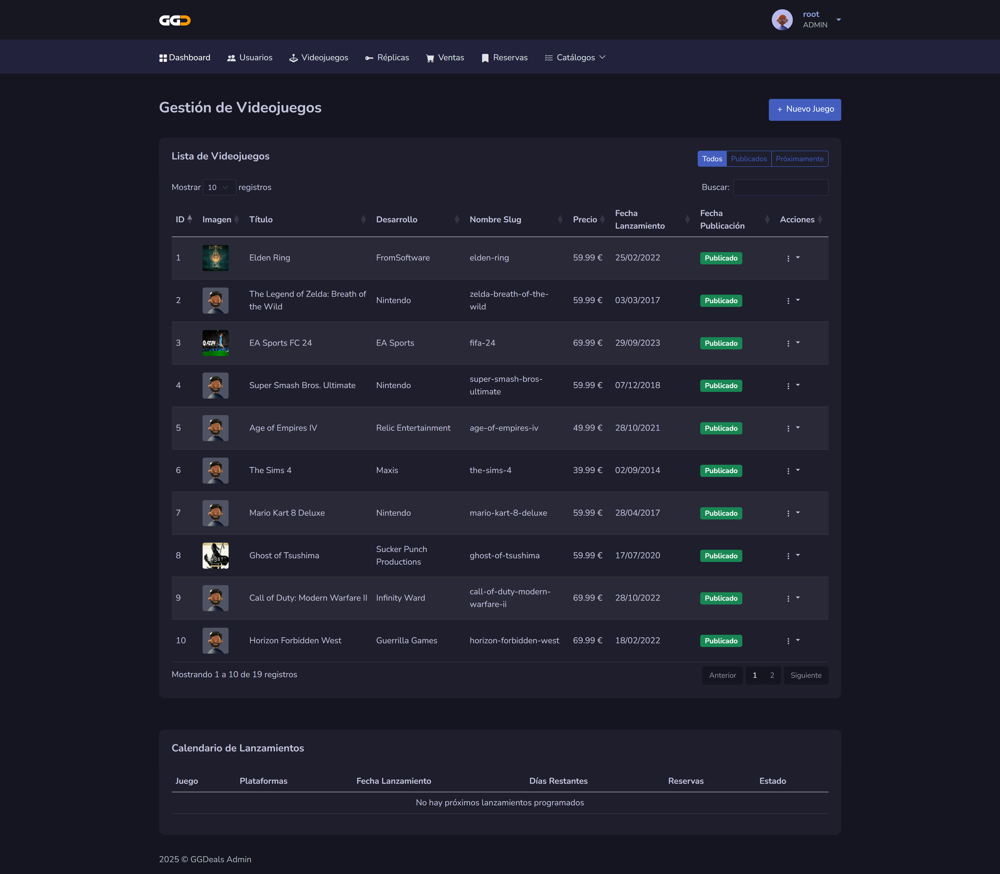
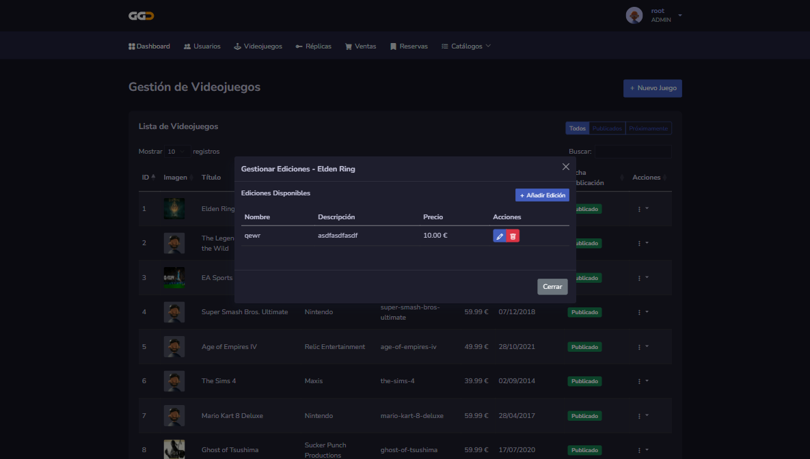
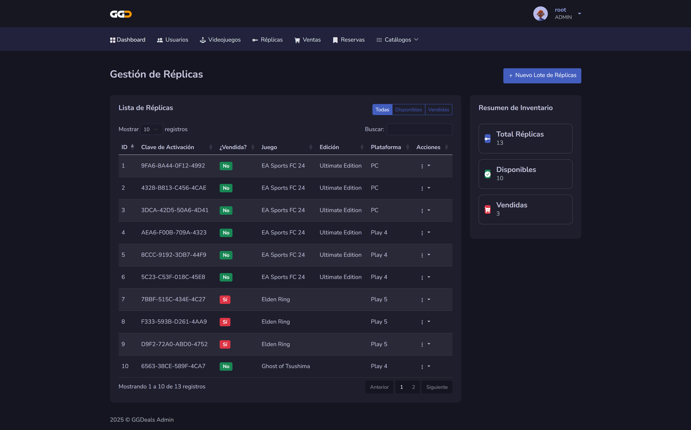

> # Cómo usar GGDeals
> 
> Esta guía explica las principales funcionalidades desde el punto de vista del usuario y del administrador.
> 
> ---
> 
> ## Usuario registrado
> 
> 1. **Registro e inicio de sesión**
>    - Accede desde la portada.
>    - Se almacena un token JWT seguro en cookies.
> 
>     
>     
> 
> 2. **Explorar el catálogo**
>    - Filtros por plataforma, características y precio.
>    - Búsqueda por nombre de juego.
>    
>    
> 
> 3. **Comprar un videojuego**
>    - Selecciona edición y plataforma.
>    - Si hay stock, se te asigna una **clave digital única**.
> 
>    
>    
>   
> 
> 4. **Perfil de usuario**
>    - Consulta tus claves, compras y perfil.
> 
>    
>    
>    
>    
> ---
> 
> ## Administrador
> 
> 1. **Login con rol ADMIN**
>    - Acceso al panel de gestión (Thymeleaf).
>      
>      Front:
>     
>     
> 
> 2. **Panel administrativo**
>    - Añadir videojuegos y ediciones.
>    - Subir claves digitales (réplicas).
>    - Ver ventas, usuarios y stock.
> 
>    
>    
>    
>    
> ---
> 
>> Todas las rutas están protegidas según rol mediante Spring Security y JWT.
